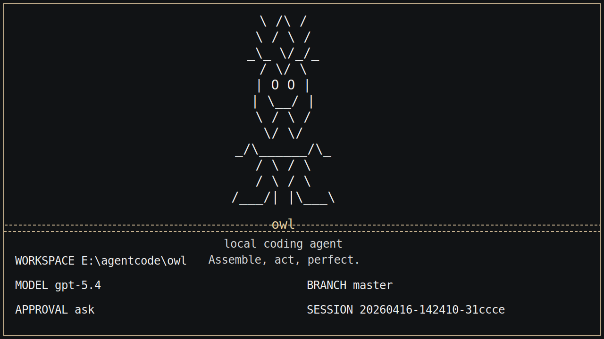
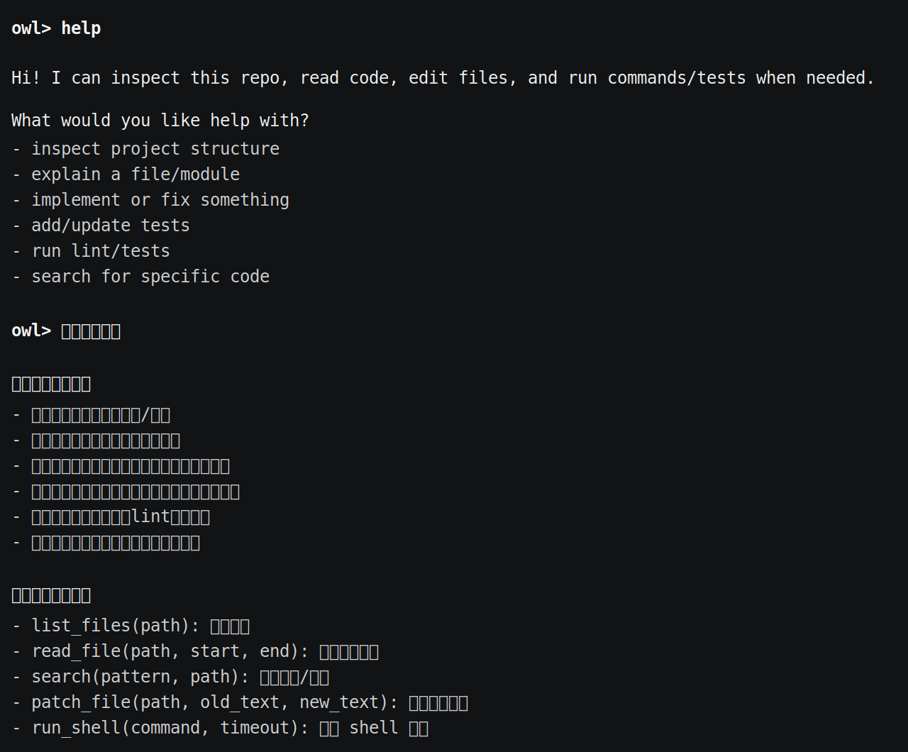

# owl

`owl` 是一个面向真实代码仓库的本地 AI Coding Agent，运行在终端中，能够结合当前工作区上下文，通过受约束的工具完成代码读取、文件修改、命令执行和任务推进。它的核心优势在于分层记忆系统，将短期工作记忆、过程压缩和长期语义记忆解耦管理，从而提升多轮任务中的上下文保持、历史经验复用和连续工程执行能力。

owl is a local AI coding agent built for real repositories and designed to work directly in the terminal. Its main strength is a layered memory architecture that separates working memory, compaction, and long-term semantic memory, enabling stronger context retention, reusable cross-run knowledge, and more stable multi-step engineering workflows across real coding tasks.

It supports Ollama, OpenAI-compatible APIs, and Anthropic-compatible APIs, with built-in session persistence, context assembly, memory management, and benchmark/evaluation workflows. It is designed for repository analysis, bug fixing, test debugging, and iterative engineering tasks.

参考开源架构包括 pico的架构(https://gitee.com/htxoffical/pico/tree/main), opencode和openclaw的记忆系统等开源代码.
## 适合做什么

- 在本地仓库里排查测试失败
- 读取当前代码结构并给出修改建议
- 基于现有文件做小步迭代，而不是脱离仓库空想
- 在会话中保留上下文，支持继续上一次工作

## 主要特性

- 包名是 `owl`
- CLI 命令是 `owl`
- 模块入口是 `python -m owl`
- 会话保存在 `.owl/sessions/`
- 每次运行的工件保存在 `.owl/runs/<run_id>/`
- 支持三类模型后端：
  - Ollama
  - OpenAI 兼容 Responses API
  - Anthropic 兼容 Messages API

## 使用截图

启动界面：



REPL 帮助示例：



## 安装

需要 Python 3.10+。

如果你用 `uv`，直接安装依赖：

```bash
uv sync
```

如果你已经在自己的 Python 环境里工作，也可以直接装成可编辑模式：

```bash
pip install -e .
```

## 快速开始

在当前仓库里启动交互模式：

```bash
uv run owl
```

指定另一个工作目录：

```bash
uv run owl --cwd /path/to/repo
```

直接跑一次性任务：

```bash
uv run owl "inspect the test failures and propose a fix"
```

如果当前环境已经安装过包，也可以直接这样启动：

```bash
python -m owl
```

## 模型后端

### Ollama

```bash
ollama serve
ollama pull qwen3.5:4b
uv run owl --provider ollama --model qwen3.5:4b
```

### OpenAI 兼容接口

```bash
export OPENAI_API_BASE="https://your-api.example/v1"
export OPENAI_API_KEY="your-api-key"
export OPENAI_MODEL="gpt-5.4"
uv run owl --provider openai
```

### Anthropic 兼容接口

```bash
export ANTHROPIC_API_BASE="https://api.anthropic.com"
export ANTHROPIC_API_KEY="your-api-key"
export ANTHROPIC_MODEL="claude-sonnet-4-6"
uv run owl --provider anthropic
```

如果你的服务端对多个兼容接口复用了同一套密钥，`owl` 也支持从 `ANTHROPIC_API_KEY` 回退到 `RIGHT_CODES_API_KEY` 或 `OPENAI_API_KEY`。

## 常用交互命令

- `/help`：查看内置命令
- `/memory`：查看提炼后的工作记忆
- `/session`：查看当前会话文件路径
- `/reset`：清空当前会话状态
- `/exit` 或 `/quit`：退出 REPL

## 安全与持久化

`owl` 不会默认把所有动作都放开。像 shell 执行、文件写入这类高风险操作，会受审批模式控制：

- `--approval ask`
- `--approval auto`
- `--approval never`

每次运行结束后，都会在 `.owl/runs/<run_id>/` 下写出这些文件：

- `task_state.json`
- `trace.jsonl`
- `report.json`

这些内容默认只保存在本地，不需要跟仓库一起提交。

## 开发

如果装了 Ruff，可以这样检查：

```bash
uv run ruff check .
```
